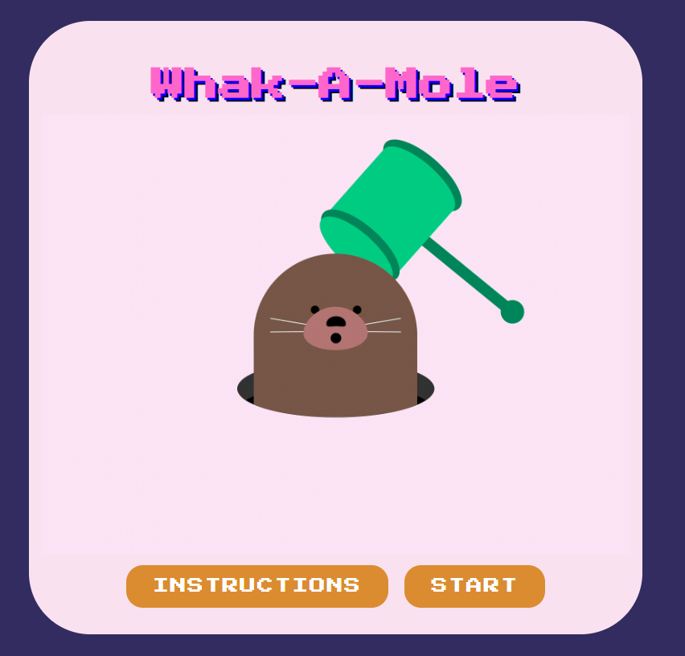
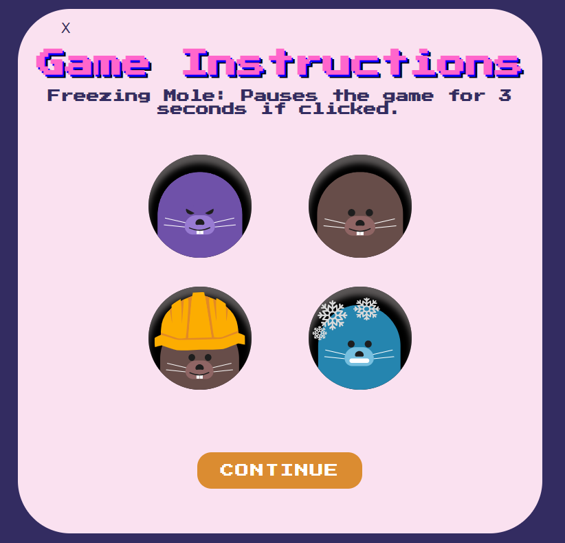
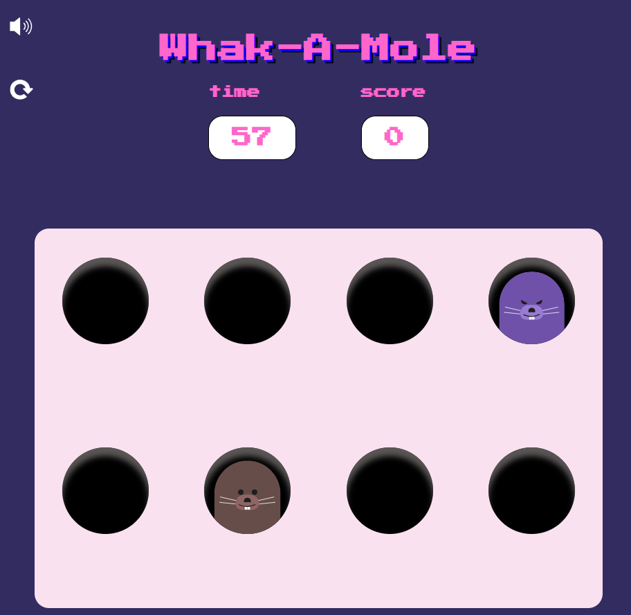
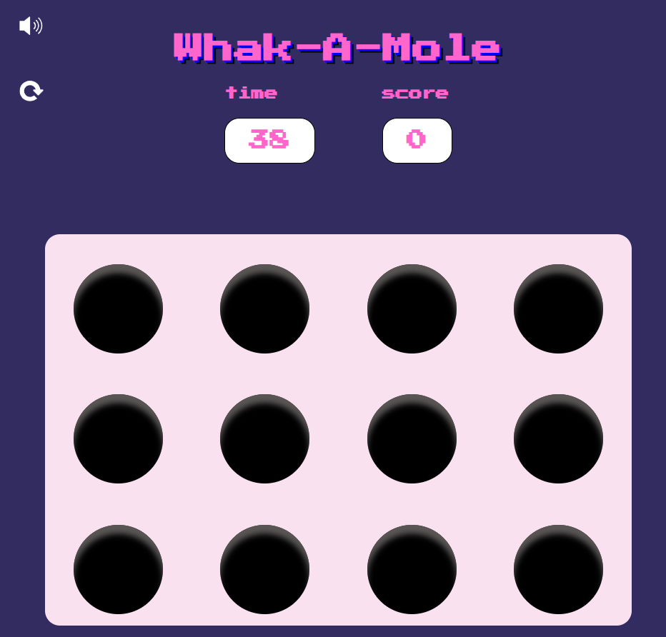

# whack A Mole

## Date: 12/09/2024

### By: Sara Alhusaini

[GitHub](https://github.com/saraisa12)
|
[Linkden](http://www.duckduckgo.com)

---

### **_Description_**

##### whak a mole is a web based game where players try to whack moles appearing randomly, the goal is to hit as many as possible within the time frame.

---

#### **_Technologies Used_**

- Front end

  - html
  - css

- Logic
  - javascript

---

#### **_Getting Started_**

##### steps in how to get started.

---

#### **_Screenshots_**

### start page

### instructions

### level 1

### level 2

---

#### **_Future Work_**

- will be posted later

---

#### **_Credits_**

- gifs: https://dribbble.com/shots/10855606-Whacked
- music: https://youtu.be/HVFYmeL9yw8?si=RfEWvF7nRljgAWhX
- W3 schools
